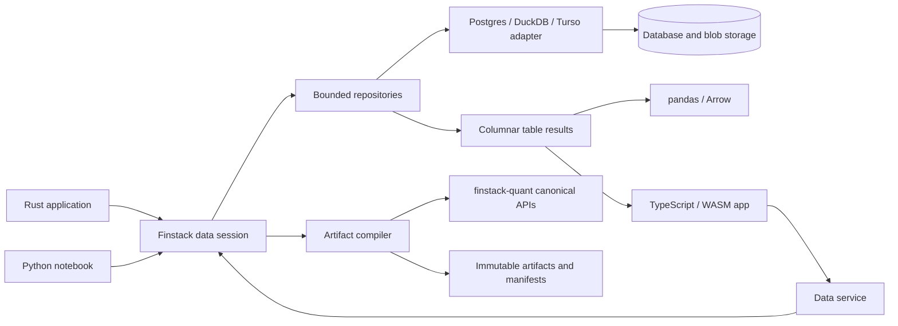

# Finstack Data Platform Product Requirements Document

| Field | Value |
| --- | --- |
| Status | Final requirements baseline |
| Version | 1.0 |
| Date | 2026-07-22 |
| Product | `finstack-data` |
| Related system | `finstack-quant` |
| Audience | Product owners, Rust maintainers, binding authors, data engineers, and application developers |

This document defines the product requirements for a database-backed Finstack
data platform. It is intentionally a PRD rather than a physical schema or
implementation plan. Exact tables, indexes, SQL libraries, service protocols,
and cache implementations belong in subsequent technical design documents.

The terms **MUST**, **SHOULD**, and **MAY** are normative.

## 1. Executive Summary

`finstack-data` will provide a single, versioned data foundation for creating
and researching Finstack inputs. It will:

- Maintain identities, security and contract masters, portfolio definitions,
  market observations, financial statements, documents, and company topology.
- Compile those sources into canonical Finstack instruments, market contexts,
  portfolios, statement models, scenarios, factor models, and analytics inputs.
- Guarantee that published master revisions and current Finstack artifacts do
  not drift apart.
- Support PostgreSQL first while preserving a common adapter contract for
  DuckDB, Turso, and future databases.
- Expose the same canonical contracts to Rust, Python, and WebAssembly.
- Provide notebook-friendly pandas representations without making pandas or a
  database ORM part of the Rust domain model.
- Materialize a representative 5,000-position portfolio in less than one
  second at the 95th percentile on defined reference hardware.

The product will be a separate project and Rust workspace from
`finstack-quant`. `finstack-quant` remains the computation engine and owner of
canonical executable artifact schemas. `finstack-data` owns database-facing
master contracts, repository abstractions, adapters, compilation orchestration,
and research access.

## 2. Problem Statement

Finstack currently accepts typed Rust values and serialized specifications for
pricing, portfolio, statement, scenario, factor-model, and analytics workflows.
The user's databases already contain many of the economic terms, identities,
observations, statements, documents, and relationships needed to construct
those inputs, but there is no canonical database boundary that:

1. Resolves related records under one historical snapshot.
2. Maps them into every supported Finstack artifact.
3. Proves that all required economic and analytical inputs were supplied.
4. Keeps derived Finstack artifacts synchronized with their source revisions.
5. Works consistently across databases and language bindings.
6. Gives research notebooks convenient, well-typed tabular access.

Without this product, applications would duplicate mapping logic, treat curve
identifiers as legal identities, mix timeless terms with current state, embed
database assumptions in bindings, and manually reconcile editable masters with
serialized Finstack objects.

## 3. Goals

### G-001: One authoritative source graph

Stable business, legal, and model definitions MUST live in versioned masters.
Finstack artifacts MUST be immutable derived outputs and MUST NOT form a second
editable source of truth.

### G-002: Complete artifact construction

The transitive graph of master, policy, lifecycle-state, and observation
revisions MUST contain enough information to create every supported Finstack
artifact without ambient defaults or ambiguous "current" lookups.

### G-003: Simple synchronization

Users MUST NOT manually synchronize security masters with Finstack instrument
JSON. Published artifacts MUST be generated from exact source revisions and
identified by a deterministic source fingerprint.

### G-004: Multiple databases

The domain and compiler MUST be independent of a concrete database. PostgreSQL,
DuckDB, Turso, and future adapters MUST implement shared repository contracts
and pass a common semantic conformance suite for the capabilities they claim.

### G-005: Universal language access

Rust applications, Python notebooks, and TypeScript/WASM applications MUST be
able to consume the same versioned contracts and compiled artifacts.

### G-006: Research ergonomics

Python users MUST be able to obtain stable, nullable, documented pandas
DataFrames for all major data domains without constructing one Python wrapper
per database row.

### G-007: Portfolio-scale performance

A representative 5,000-position portfolio MUST materialize into a reusable
Finstack portfolio handle in less than one second p95 under the benchmark
contract in Section 16.

### G-008: Reproducible research

Historical queries MUST distinguish what was economically effective from what
was known to the system at the time. Artifacts MUST carry sufficient lineage to
reproduce or explain their inputs.

## 4. Non-Goals

The first product release is for a trusted research and application environment.
It is explicitly not intended to provide:

- Role-based access control, SSO, multi-tenant isolation, or enterprise
  permission administration.
- Fine-grained data entitlements or an enterprise approval workflow.
- Multi-region operation or peer-to-peer multi-writer synchronization between
  databases.
- A universal ORM or a lowest-common-denominator SQL abstraction.
- A replacement pricing, risk, statement, scenario, or analytics engine.
- Direct production database credentials in browser applications.
- Vendor-specific ingestion connectors for every upstream source.
- A general document-management system.
- A required vector database, graph database, or full-text search engine.
- An administrative UI.

Basic database credential handling, source provenance, validation, backups, and
migration safety remain required. They support correctness rather than
enterprise access control.

## 5. Primary Users and Use Cases

### Quantitative researcher

- Query entities, instruments, statements, market observations, documents, and
  relationships into pandas.
- Reconstruct the data as known on a historical research date.
- Materialize a portfolio once and reuse it for valuation, scenarios, cashflows,
  and analytics.

### Rust application developer

- Use typed repositories and compiler APIs without depending on SQL schemas.
- Receive native Finstack artifacts and runtime handles.
- Swap supported database adapters without changing domain logic.

### TypeScript application developer

- Query a service for versioned DTOs and table results.
- Validate or compile portable bundles in WASM.
- Reuse a built portfolio handle across interactive calculations.

### Data maintainer

- Create corrected master revisions without rewriting history.
- Publish a coherent set of revisions and inspect compilation failures.
- Explain which source records produced an artifact.

### Representative workflows

1. Resolve a company, its issuers, securities, statements, documents, and
   topology from one stable identity.
2. Compile a security or contract master into a valid `InstrumentEnvelope`.
3. Build a market context from observations, calibration plans, and policies.
4. Materialize a 5,000-position portfolio into a reusable Finstack handle.
5. Build a financial model from a model template, statement facts, assumptions,
   and capital structure.
6. Load scenario, factor-model, and analytics definitions with their required
   observation panels.
7. Query historical revisions using both `as_of` and `known_at`.

## 6. Product and Repository Boundary

### 6.1 Separate product

`finstack-data` MUST be a separate project/workspace from `finstack-quant`.
This keeps database drivers, migrations, services, and storage policy out of the
quantitative computation workspace.

The proposed crate/package decomposition is:

| Component | Responsibility |
| --- | --- |
| `finstack-data-contracts` | Stable IDs, revision headers, typed master DTOs, policies, queries, diagnostics, and manifests |
| `finstack-data-compiler` | Pure mapping from resolved source graphs to Finstack artifacts |
| `finstack-data-repository` | Bounded repository traits, publication orchestration, materialization bundles, and adapter capability contracts |
| `finstack-data-postgres` | PostgreSQL implementation and migrations |
| `finstack-data-duckdb` | DuckDB implementation and snapshot/analytical support |
| `finstack-data-turso` | Turso implementation when its claimed capability tier passes conformance |
| `finstack-data-service` | Network boundary used by browser and remote clients |
| `finstack-data-py` | Native Python facade, pandas conversion, and supported native adapters |
| `finstack-data-wasm` | Browser-safe contracts, validation, compilation, tables, and service client |

Names may be refined in a TDD, but the dependency boundaries are requirements.

### 6.2 Dependency direction

- `finstack-data-compiler` MAY depend on published `finstack-quant` crates.
- `finstack-quant` domain crates MUST NOT depend on database adapters or
  repository implementations.
- Required generic constructors, versioned envelopes, validation entry points,
  and batch materialization APIs MAY be added to `finstack-quant`.
- Database adapters MUST NOT contain pricing, analytical, or product-semantic
  mapping logic.
- Python and WASM bindings MUST delegate semantic behavior to canonical Rust
  code.

### 6.3 Proposed target architecture



The diagram describes the target product, not functionality currently present
in this repository.

## 7. Canonical Data Lifecycles

The product MUST distinguish five lifecycles:

| Lifecycle | Meaning | Examples |
| --- | --- | --- |
| Master | Stable business, legal, reference, or model definition | Entity, security terms, contract payoff, statement template |
| Policy | Reusable mapping or calculation behavior | Curve binding, pricing model, forecast rule, scenario definition |
| Observation/state | Bitemporal fact or changing lifecycle value | Quote, fixing, current balance, default, barrier observation |
| Derived artifact | Immutable output with complete input manifest | Instrument envelope, calibrated curve, factor model |
| Compiled bundle | Fully resolved transient or cached runtime input | Portfolio materialization bundle, scenario execution context |

A legal master MUST NOT absorb changing market observations merely to make an
artifact self-contained. Instead, an artifact compiler resolves the required
master, policy, state, and observation revisions under one explicit snapshot.

## 8. Identity, Revision, and Temporal Requirements

### 8.1 Stable identity

- Every entity, issuer, security, contract, listing, facility, index, portfolio,
  document, topology node, and policy MUST have an opaque stable ID.
- External identifiers MUST be versioned aliases with an explicit namespace,
  source, validity interval, and confidence or resolution status where needed.
- Identifiers MUST never be reused.
- Entity merges and splits MUST be represented by reversible, effective-dated
  relationships or redirects; historical artifacts MUST NOT be re-keyed.
- Role-specific relationships MUST distinguish issuer, obligor, guarantor,
  counterparty, underlying, reference entity, owner, and parent.

### 8.2 Revision header

Every persisted master and policy revision MUST provide:

- Stable object ID and immutable revision ID.
- Object kind and payload schema ID/version.
- `valid_from` and optional `valid_to` economic-effectivity timestamps.
- `known_from` and optional `known_to` system-knowledge timestamps.
- Draft, published, superseded, or retired status.
- Source and source-record identity.
- Canonical content hash.
- Created timestamp and optional correction reason.

Intervals MUST be half-open. System timestamps MUST be UTC. Date-only economic
terms MUST remain date values rather than midnight timestamps.

### 8.3 Historical query semantics

Canonical queries MUST accept both:

- `as_of`: when the fact or definition was economically effective.
- `known_at`: what the system knew at the requested time.

An unqualified `current` MAY exist as a convenience facade, but MUST resolve to
documented `as_of` and `known_at` values and MUST NOT be used inside artifact
manifests.

### 8.4 Publication sets

A publication set is an immutable, coherent collection of exact revisions.
Publishing MUST atomically advance an active publication-set pointer only after
all required validation and compilation gates succeed.

## 9. Domain Repositories

The product MUST expose one data session with bounded repositories rather than
one generalized market-data adapter or separate unrelated ORMs.

| Repository | Required scope |
| --- | --- |
| Entities | Legal entities, issuers, obligors, counterparties, aliases, and hierarchies |
| Instruments | Securities, contracts, listings, underlyings, indices, facilities, pools, deals, and product terms |
| Market | Quotes, spots, fixings, series, calibration plans, conventions, curves, and surfaces |
| Portfolios | Portfolios, books, positions, quantities, and exact artifact references |
| Financials | Statement facts, model templates, forecasts, checks, and capital structures |
| Scenarios | Scenario definitions, rate bindings, and target-resolution policies |
| Factors | Factor taxonomies, mappings, covariance inputs, calibration policies, and models |
| Analytics | Series definitions, dataset definitions, benchmarks, and transform policies |
| Documents | Document metadata, company links, content/blob references, extracted text, and revisions |
| Topology | Typed nodes and effective-dated relationship edges |
| Artifacts | Compiled outputs, manifests, validation reports, hashes, and active pointers |

Repository methods MUST use canonical DTOs and MUST NOT expose ORM entities as
the public API.

For trusted notebook research, a native adapter MAY expose an explicitly
nonportable, read-only SQL escape hatch. Portable application behavior MUST use
typed repositories and queries.

## 10. Security, Contract, and Specialized Masters

### 10.1 Required master families

The source graph MUST support:

- Entity, issuer, obligor, and counterparty masters.
- Security and listing masters.
- OTC contract and trade masters.
- Exchange-contract and deliverable-basket masters.
- Underlying, rate-index, commodity, FX-pair, index-series, and basket masters.
- Loan and revolving-facility masters.
- Corporate-action and conversion-adjustment ledgers.
- Mortgage-pool and remittance-state masters.
- Structured-deal, collateral-pool, tranche, waterfall, test, and account
  masters.
- Reference-entity, reference-obligation, and deliverable-obligation masters.
- Property, private-fund, and model-definition masters.
- Portfolio, book, and position masters.
- Versioned calendar and convention registries.

Curve-binding, pricing, prepayment, stochastic, metric, scenario, forecast, and
factor-matching choices are policies, not security-master fields.

### 10.2 Required information closure

For every supported compile target, the transitive source graph MUST resolve:

- Stable object, revision, issuer, counterparty, underlying, and reference IDs.
- Currency, denomination, notional, quantity, side, and position-unit semantics.
- Issue, trade, effective, start, maturity, expiry, exercise, payment, fixing,
  and settlement dates.
- Coupon, rate, spread, strike, floor, cap, gearing, compounding, and redemption
  terms.
- Complete schedule conventions: frequency, day count, calendars, business-day
  adjustment, stubs, end-of-month, reset/payment/fixing lags, lookback,
  lockout, and observation shift.
- Amortization, prepayment, draw, repayment, fee, call, put, conversion,
  barrier, exercise, and settlement provisions.
- Collateral, CSA, clearing, netting, seniority, documentation-clause, and legal
  document relationships where relevant.
- Index constituents and weights, exchange multipliers and ticks, delivery
  specifications, pool terms, tranche terms, and waterfalls where relevant.
- Lifecycle state such as current balances, draws, defaults, recoveries, pool
  factors, deferred interest, observed extrema, initial levels, and fixings.
- Market-binding identifiers for discount, forward, credit, inflation, spot,
  price, volatility, FX, and time-series dependencies.
- Downstream analytical metadata, including exact issuer identifiers and factor
  taxonomy attributes.
- Source revisions, policy revisions, snapshot timestamps, compiler version,
  Finstack version, and hashes.

Required data MAY be owned directly by a master or reached through an exact,
typed revision reference. A compiler MUST NOT silently resolve an unspecified
reference to whichever record happens to be current.

### 10.3 Trade and state separation

A security master normally describes a per-unit economic template. Trade and
position records own quantity, side, entry price, trade date, book, and
position-level attributes. Current balances, realized events, fixings, and
path-dependent state MUST be separately revisioned observations or lifecycle
state.

## 11. Artifact Compilation and Synchronization

### 11.1 Compile request

A compile request MUST identify:

- Target artifact/profile.
- Root object and exact or resolvable publication set.
- `as_of` and `known_at`.
- Policy set.
- Requested Finstack artifact schema and engine compatibility range.

### 11.2 Compile targets

The compiler MUST support target-specific readiness rather than a generic
`complete: bool`:

- Instrument definition.
- Pricing-ready instrument snapshot.
- Market context.
- Portfolio valuation input.
- Financial-model evaluation input.
- Scenario application input.
- Factor-risk input.
- Factor-calibration input.
- Performance-analytics input.

Draft masters MAY be incomplete. A published revision claiming a target
profile MUST pass that profile's complete validation contract.

### 11.3 Compile pipeline

Every compiler MUST:

1. Validate source schema versions.
2. Validate local semantic invariants.
3. Resolve every master and policy reference to an exact revision.
4. Select observations and state under one bitemporal snapshot.
5. Detect missing, ambiguous, cyclic, or unsupported dependencies.
6. Construct through canonical Finstack APIs.
7. Run the artifact's canonical schema and semantic validation.
8. Extract or declare market and analytical dependencies.
9. Canonically serialize and hash the artifact.
10. Emit a manifest and structured compile report.

### 11.4 Compile report

The report MUST distinguish:

- Missing required inputs.
- Ambiguous identities or bindings.
- Unsupported product behavior.
- Invalid source values.
- Unresolved cross-references.
- Cyclic dependencies.
- Warnings that do not affect declared readiness.

Unresolved or ambiguous inputs MUST be fatal for publication. They MUST NOT be
downgraded to warning-only behavior.

### 11.5 Artifact manifest

Every published artifact MUST record:

- Artifact ID, type, schema, and content hash.
- Publication-set ID and source-graph fingerprint.
- Exact master, policy, state, and observation revision IDs.
- `as_of` and `known_at`.
- Compiler version and build identity.
- Finstack crate/engine version.
- Canonicalization/hash algorithm version.
- Validation outcome and declared readiness profile.

### 11.6 Synchronization invariant

Every published source graph MUST have one compilation state:
`pending`, `ready`, `blocked`, `failed`, or `superseded`.

A current lookup MUST return only a `ready` artifact whose source fingerprint,
publication-set ID, compiler version, and Finstack version match the active
publication. No stale, unresolved, or orphaned artifact may be returned as
current.

Artifacts MUST NOT be edited directly. Recompilation creates a new artifact
revision and atomically advances the active pointer after successful
validation. Caches MUST be keyed by the immutable fingerprint rather than
invalidated by convention.

### 11.7 Determinism

- Definition artifacts MUST have deterministic canonical bytes and hashes for
  identical inputs and versions.
- Map and set ordering, string normalization, decimal conversion, date formats,
  defaults, and calendar versions MUST be explicit.
- `NaN` and infinity MUST be rejected from persisted canonical contracts.
- Numerically calculated outputs MAY use documented cross-platform tolerances
  where native and WASM floating-point behavior cannot guarantee byte equality.

## 12. Coverage of Finstack Artifacts

### 12.1 Instruments

The compiler registry MUST be checked against
`finstack_quant_valuations::schema::instrument_types()`. The completed product
MUST contain one compiler recipe and representative source fixture for every
canonical instrument tag.

For each tag, CI MUST:

1. Compile the representative source graph.
2. Validate against `instrument_schema(tag)`.
3. Run `validate_instrument_envelope_json()`.
4. Reload through `InstrumentEnvelope::from_value()`.
5. Confirm that all declared market dependencies can be resolved for a
   pricing-ready fixture.
6. Confirm required downstream risk attributes are present.
7. Round-trip the compiled artifact without information loss.

Adding a Finstack instrument tag without a compiler recipe and fixture MUST
fail CI.

### 12.2 Market context

- Calibration-plan and convention definitions are masters or policies.
- Quotes, spots, fixings, prices, dividends, and series are observations.
- Calibrated curves and surfaces are derived artifacts.
- A `MarketContextState` is a versioned derived snapshot.
- Compilation MUST validate quote sets, dependencies, prior objects, curve
  roles, and requested schema.

### 12.3 Portfolio

- Portfolio and book identity are masters.
- Positions and quantities are effective-dated state.
- Positions MUST reference exact compiled instrument revisions in the database
  hot path.
- A durable portfolio envelope MUST be schema-versioned.
- Materialization MUST construct through a canonical Finstack validation path
  and return a reusable runtime handle.

### 12.4 Statements

- Model templates, metric registries, formulas, forecast rules, check suites,
  and capital-structure definitions are masters or policies.
- Period facts, assumptions, and overrides are observations.
- Compilation MUST produce a validated `FinancialModelSpec` and MUST fail on
  unknown formula or waterfall references required by the target profile.
- Capital-structure debt references MUST resolve to exact instrument artifacts.

### 12.5 Scenarios

- Scenario and rate-binding definitions are policies.
- Durable scenario and rate-binding envelopes MUST be versioned.
- Compilation MUST resolve every curve, surface, hierarchy, instrument, and
  binding target before publication.

### 12.6 Factor models

- Factor taxonomy and market mappings are masters.
- Matching, bump, and calibration settings are policies.
- Covariance, histories, spreads, tags, and calibration panels are observations
  or derived estimates.
- Compiled configurations and calibrated models MUST validate factor IDs,
  covariance ordering, shape, symmetry, and positive-semidefinite requirements.

### 12.7 Analytics

- Series and dataset definitions are masters.
- Price, return, benchmark, and feature rows are observations.
- Benchmark, missing-data, and transform behavior are policies.
- Runtime analytics objects and caches are derived and MUST NOT become source
  masters.

### 12.8 Documents and topology

- Documents and topology share identity, temporal, revision, and provenance
  contracts with financial data.
- They retain separate repository and query models.
- Document metadata and extracted text MAY live in the database; large binary
  content SHOULD be represented through a content-addressed blob reference.
- Embeddings and search indexes are derived artifacts with model/index version
  metadata.
- Topology MUST be representable as typed nodes and effective-dated edges and
  exportable as pandas node and edge tables.

## 13. Database Adapter Requirements

### 13.1 Authority model

Each deployment or dataset MUST have exactly one authoritative writer.
Supporting several adapters does not imply simultaneous multi-master writes.

- PostgreSQL is the first authoritative collaborative implementation.
- DuckDB is required as a local analytical/snapshot implementation and MAY
  qualify as an authoritative standalone implementation if it passes the
  required write capability suite.
- Turso is a planned adapter and MAY claim read/write authority only after its
  transaction and conflict semantics pass the same tier.

### 13.2 Capability contract

Adapters MUST declare and test support for:

- Atomic transactions and publication-pointer updates.
- Uniqueness and optimistic concurrency.
- Bitemporal query precision.
- Decimal and timestamp fidelity.
- Stable ordering under explicit sort keys.
- JSON or equivalent canonical payload storage.
- Bulk reads and writes.
- Schema migrations and migration locking appropriate to the backend.
- Concurrent reader/writer behavior.
- Blob-reference storage where supported.

Unsupported capabilities MUST be rejected explicitly. An adapter MUST NOT
silently provide weaker semantics than it advertises.

### 13.3 Query behavior

- Repository queries MUST support projection, filtering, deterministic ordering,
  pagination or streaming, and explicit historical snapshots.
- Portfolio materialization MUST use bounded bulk queries and MUST prohibit
  one query per position or instrument.
- Large observations and statement datasets SHOULD stream in columnar batches.
- Adapter-specific SQL MAY be available as a read-only research escape hatch
  but has no cross-backend portability guarantee.

### 13.4 Conformance

One backend-neutral conformance suite MUST test identity resolution, revisions,
bitemporal queries, publication atomicity, canonical ordering, numeric fidelity,
artifact retrieval, table schemas, and materialization fixtures for every
adapter capability tier.

## 14. Rust, Python, and WASM APIs

### 14.1 Rust

Rust is the canonical domain and compiler implementation. Rust applications
MUST receive typed DTOs, compile reports, Finstack artifacts, and native runtime
handles. The compiler MUST be pure with respect to database I/O; repositories
resolve inputs before invoking it.

### 14.2 Python

The Python API MUST:

- Provide the same typed repository and compile concepts using Python naming
  consistent with canonical Rust.
- Support native PostgreSQL and DuckDB access when their adapters ship.
- Return a `finstack_quant.portfolio.Portfolio`-compatible typed handle from
  portfolio materialization without a normal-path JSON round trip.
- Release the GIL during database-independent compilation and portfolio
  construction.
- Provide `to_pandas()` for all table results and `to_arrow()` when the optional
  Arrow integration is installed.
- Centralize error mapping into documented Python exception classes.

### 14.3 WebAssembly and TypeScript

The WASM/TypeScript API MUST expose the complete portable contract, validation,
compiler, table, and runtime-handle surface. Database access in browser
applications MUST go through the service or an explicitly loaded local
snapshot; browser WASM MUST NOT contain native database drivers or production
database credentials.

Large table results SHOULD use column arrays or Arrow IPC rather than arrays of
per-row JavaScript objects.

### 14.4 Parity and versioning

- Rust names are canonical; Python uses matching `snake_case`, and TypeScript
  uses matching `camelCase`.
- A machine-readable parity contract MUST enumerate supported symbols and
  documented host-language exceptions.
- Contract schema versions MUST be independent of package semantic versions.
- Bindings MUST reject unsupported future schema versions with typed errors.

## 15. Pandas and Tabular Research Requirements

### 15.1 Host-neutral table contract

The platform MUST use a host-neutral, column-oriented table contract rather
than taking a pandas dependency in Rust domain crates. The existing Finstack
`TableEnvelope` is the starting model and MUST be extended or wrapped to cover:

- Non-null and nullable strings.
- Signed and unsigned integers.
- Floating-point values.
- Booleans.
- Date and UTC timestamp values.
- Exact decimals.
- Binary or canonical JSON payload columns where unavoidable.
- Column roles, units, currencies, semantic types, and table-layout metadata.

All columns MUST have equal row counts and deterministic order.

### 15.2 Python conversion

- `query(...).to_pandas()` MUST be the normal notebook workflow.
- Conversion MUST operate on whole columns, not serialize and parse one JSON
  object per row.
- Nulls MUST use pandas nullable dtypes rather than silently becoming ambiguous
  object values.
- Exact decimal values MUST not be converted through binary floating point
  unless the caller explicitly requests it.
- Dates and timestamps MUST retain date/timezone semantics.
- Arrow-backed pandas dtypes SHOULD be available as an optional fast path.
- DataFrames MUST use explicit ID/date columns by default; callers may choose
  their own index.

### 15.3 Standard table projections

The platform MUST define and document stable projections for:

| Projection | Required shape |
| --- | --- |
| Instruments | One row per instrument revision with common identity, type, issuer, currency, date, status, and artifact fields |
| Instrument terms | Separate typed table per product family rather than a null-heavy universal table |
| Positions | One row per effective-dated position |
| Identifiers | Long-form object, namespace, value, source, and validity rows |
| Relationships | Long-form typed edge list |
| Cashflows | Long-form instrument, date, kind, currency, and amount rows |
| Market observations | Tidy long form with explicit field, unit, source, `as_of`, and `known_at` |
| Statements | Canonical long form plus an explicit wide/pivot helper |
| Documents | Metadata and content references; large bodies excluded by default |
| Topology | Separate node and edge tables |
| Lineage | Artifact-to-source revision rows |

### 15.4 Illustrative Python experience

```python
with finstack_data.connect("postgresql://...") as data:
    instruments = data.instruments.query(
        instrument_type="bond",
        as_of="2026-06-30",
    ).to_pandas()

    statements = data.financials.query(
        entity_id="ENTITY-ACME",
        layout="long",
    ).to_pandas()

    portfolio = data.portfolios.materialize(
        "CREDIT-BOOK",
        as_of="2026-06-30",
    )
```

This example is an experience requirement, not a finalized package signature.

## 16. Portfolio Materialization Performance

### 16.1 Definition

The timed materialization operation begins when the adapter query is invoked
and ends when a reusable typed Finstack portfolio handle is returned with:

- The requested publication set resolved.
- Portfolio, entity, book, and position records fetched.
- All distinct published instrument artifacts fetched in bounded bulk queries.
- Each unique instrument artifact deserialized and validated once on an empty
  in-process artifact cache.
- 5,000 runtime positions constructed with shared instrument handles.
- Position, entity, attribute, and market-dependency indexes ready.
- Final portfolio invariants validated.

The benchmark excludes valuation, market-context construction, pandas
conversion, client-network transfer, JSON re-serialization, process startup,
and initial connection-pool creation. These operations MUST be measured
separately.

### 16.2 Service levels

| Case | Requirement |
| --- | --- |
| Representative 5,000-position portfolio, cold in-process portfolio/instrument cache, warm database pages | Hard acceptance: p95 less than 1,000 ms |
| Same uncached materialization path | Design target: p95 less than 500 ms |
| Warm content-addressed instrument cache | Design target: p95 less than 250 ms |
| Stable 5,000-row common pandas projection | Design target: p95 less than 100 ms |
| Material performance regression | Alert/fail review when greater than 10% unless the absolute gate and an approved explanation apply |

The TDD MUST define reference hardware, operating system, database topology,
dataset size, sample count, warm-up protocol, and statistical method. No
current performance claim is made by this PRD.

### 16.3 Mandatory fixtures

Benchmarks MUST include:

1. 5,000 positions referencing 5,000 unique, representative multi-asset
   instrument revisions, including schedule-rich products.
2. 5,000 positions referencing a smaller repeated set, proving deduplication
   and shared instrument handles.
3. PostgreSQL and DuckDB measured independently; Turso measured independently
   when implemented.
4. Rust release mode, Python release-profile bindings, and browser WASM where
   the operation is supported.

Every result MUST record input bytes, unique instrument count, dependency
count, peak memory, allocation count where available, and phase timings for
query, decode/validation, position construction, index construction, and
binding conversion.

### 16.4 Required fast-path design

- Positions MUST reference unique instrument artifact revisions rather than
  embedding duplicate artifact JSON in the database hot path.
- One normalized materialization bundle MUST contain a map of unique artifacts
  and lightweight positions referencing them.
- Compiled runtime instruments and flattened dependency keys MUST be cached
  together by artifact hash.
- Repeated positions MUST reuse shared `Arc<dyn Instrument>` values.
- Deterministic parallel decoding MAY be used above a measured threshold, with
  original position order restored before portfolio construction.
- The portable embedded `PortfolioSpec` remains available for interchange but
  MUST NOT be the required database materialization path.
- Python MUST receive one reusable portfolio handle, not 5,000 individual
  Python instrument objects.

## 17. Functional Requirements Summary

| ID | Requirement |
| --- | --- |
| FR-001 | Provide a separate `finstack-data` project with backend-neutral contracts and compiler layers. |
| FR-002 | Preserve the dependency direction from data platform to `finstack-quant`, never from quant domain crates to adapters. |
| FR-010 | Provide opaque stable identities, versioned aliases, and typed relationships. |
| FR-011 | Provide immutable bitemporal master, policy, state, and observation revisions. |
| FR-012 | Support coherent, atomically published revision sets. |
| FR-020 | Provide bounded repositories for every domain in Section 9. |
| FR-021 | Provide PostgreSQL first and conformance-based DuckDB, Turso, and future adapters. |
| FR-022 | Permit one authoritative writer per deployment/dataset; do not implement cross-backend multi-master writes. |
| FR-030 | Compile every supported source graph through canonical Finstack APIs. |
| FR-031 | Emit immutable artifacts, structured reports, manifests, and deterministic fingerprints. |
| FR-032 | Prevent a stale or mismatched artifact from being returned as current. |
| FR-033 | Match the complete canonical Finstack instrument registry before claiming full instrument coverage. |
| FR-034 | Support market, portfolio, statement, scenario, factor, and analytics compile targets. |
| FR-040 | Expose canonical Rust, Python, and WASM contracts and validation behavior. |
| FR-041 | Return existing-compatible Finstack runtime handles without normal-path JSON rebuilding. |
| FR-042 | Maintain a machine-readable cross-language parity contract. |
| FR-050 | Provide host-neutral columnar table results and stable standard projections. |
| FR-051 | Provide efficient nullable pandas conversion for every major data domain. |
| FR-052 | Keep documents and topology within the shared identity/revision platform but in separate repositories. |
| FR-060 | Meet the 5,000-position materialization hard acceptance gate. |
| FR-061 | Provide release-profile, backend-specific, phase-instrumented performance benchmarks. |
| FR-070 | Provide schema migrations, artifact/compiler version separation, and upgrade/recompilation paths. |
| FR-071 | Preserve source provenance and historical reproducibility without enterprise RBAC machinery. |

## 18. Data Quality and Operational Requirements

### 18.1 Validation states

Source records SHOULD move through explicit raw, normalized, validated,
quarantined, and published states. Failed records MUST remain inspectable and
replayable rather than being silently discarded.

Validation MUST cover schema, references, temporal intervals, units,
currencies, schedules, uniqueness, identifier collisions, source precedence,
staleness, and target-specific readiness.

The platform MUST preserve the distinction among zero, unknown, unavailable,
and not applicable.

### 18.2 Corrections and overrides

- Corrections create new revisions; they do not mutate published history.
- Overrides MUST record a source/reason and be visible in lineage.
- Identity merges, splits, backdated corrections, and policy changes MUST be
  reproducible under `known_at` queries.

### 18.3 Reconciliation

The platform MUST be able to reconcile:

- Published masters against compiled artifacts.
- Artifact manifests against referenced revisions.
- Authoritative storage against snapshots or replicas.
- Blob metadata against stored content.
- Canonical tables against optional search or embedding indexes.

Hashes, revision manifests, row counts, and control totals SHOULD be used where
appropriate.

### 18.4 Jobs and failure recovery

Compilation and publication operations MUST be idempotent. A process failure
after artifact storage but before publication MUST be safely retryable without
creating duplicate active revisions or exposing a partial publication.

A simple synchronous implementation is acceptable initially. If background
jobs are introduced, they MUST have explicit pending, running, ready, failed,
and superseded states and bounded retries.

### 18.5 Backup and reproducibility

Source revisions, publication pointers, manifests, and non-reconstructible
documents MUST be backed up. Derived artifacts MAY be rebuilt only when the
required source revisions, policies, and compatible compiler/Finstack versions
remain available. Otherwise the artifact itself MUST be retained.

## 19. Schema and Compatibility Requirements

The following versions MUST remain distinct:

- Physical database schema version.
- Canonical master/policy contract version.
- Individual object revision.
- Publication-set revision.
- Finstack artifact schema version.
- Compiler version.
- Finstack engine/crate version.
- Rust/Python/WASM/service package version.

Database migrations MUST NOT appear as new economic knowledge and MUST NOT
rewrite bitemporal history. Breaking persisted-contract changes require an
explicit migration or recompilation path consistent with
[`SERDE_STABILITY.md`](SERDE_STABILITY.md).

A newer compiler or Finstack version produces a new artifact revision; it MUST
NOT overwrite the historical output of an older version.

## 20. Known Finstack Integration Prerequisites

The following current-state gaps must be resolved before the corresponding
product families can claim complete round-trip support:

1. `AgencyTba.assumed_pool` is skipped by serde and cannot currently be
   preserved in a compiled JSON artifact.
2. CDS and CDS-option artifacts need explicit stable reference-entity,
   reference-obligation, and underlying-contract/index-series identities rather
   than treating curve IDs as legal identity.
3. Repo collateral references use weak strings and need typed revision
   references at the data/compiler boundary.
4. Structured-credit `PoolAsset::from_bond` is intentionally lossy for floating
   and step-up bonds; full source assets must remain authoritative and any
   projection must be an explicit policy.
5. Several products mix contractual terms with as-of state, requiring an exact
   state revision in the compile manifest.
6. Embedded product/default registries need resolved-value and registry-version
   fingerprints.
7. Durable portfolio, scenario, rate-binding, and generic factor-config
   envelopes need explicit version contracts.
8. Existing manual instrument round-trip tests do not prove coverage of the
   complete canonical instrument registry.

These are integration prerequisites, not reasons to move product semantics into
database adapters.

## 21. Acceptance Criteria

The product is complete for its declared v1 scope when:

1. PostgreSQL passes the authoritative adapter conformance suite.
2. DuckDB passes its declared local/snapshot capability suite.
3. Every canonical Finstack instrument tag has a compiler recipe, fixture,
   schema validation, semantic validation, dependency preflight, and lossless
   round trip.
4. Market-context, portfolio, statement, scenario, factor, and analytics
   targets have versioned compile requests, reports, and manifests.
5. A changed published master cannot yield a stale artifact as current.
6. Historical `as_of`/`known_at` tests cover corrections, aliases, and identity
   merge/de-merge behavior.
7. Rust receives native artifacts and runtime handles through typed APIs.
8. Python can materialize a portfolio and query every major repository into
   pandas with documented stable dtypes.
9. TypeScript/WASM can consume the same portable contracts, validate artifacts,
   use runtime handles, and query through the service.
10. Cross-language parity checks pass for the declared surface.
11. The 5,000-position benchmark passes the hard p95 latency gate in release
    mode on the reference environment.
12. Adapter ordering differences do not change canonical definition-artifact
    bytes or hashes.
13. Compilation failures identify missing, ambiguous, cyclic, and unsupported
    inputs distinctly.
14. Documentation includes the logical model, adapter capability matrix,
    Python notebook examples, service/WASM examples, migration policy, and
    benchmark procedure.

## 22. Delivery Sequence

### Milestone A: Contracts and prerequisites

- Create the separate workspace and canonical IDs/revision contracts.
- Define publication sets, manifests, compile reports, and table schemas.
- Add required Finstack constructors/versioned envelopes.
- Resolve the known round-trip blockers required by the first vertical slice.

### Milestone B: Instrument, market, and portfolio vertical slice

- Implement PostgreSQL identity, instrument, market, portfolio, and artifact
  repositories.
- Compile a representative cross-asset set into Finstack artifacts.
- Implement typed portfolio materialization and the 5,000-position benchmark
  before broadening scope.
- Expose Rust and Python APIs.

### Milestone C: Research data and pandas

- Add financials, documents, topology, series, and analytics repositories.
- Implement stable standard table projections and pandas conversion.
- Add notebook examples covering company-level research joins.

### Milestone D: Complete artifact and adapter coverage

- Complete the canonical instrument registry.
- Add statement, scenario, factor, and analytics compile targets.
- Add DuckDB conformance and snapshot workflows.
- Add the service and complete WASM/TypeScript surface.
- Add Turso after its capability contract is implemented and tested.

### Milestone E: Release hardening

- Pass full parity, conformance, migration, determinism, historical-query, and
  performance gates.
- Document unsupported adapter capabilities explicitly.
- Establish saved performance baselines and regression thresholds.

## 23. Risks and Mitigations

| Risk | Mitigation |
| --- | --- |
| One giant nullable master model | Common revision header plus typed product payloads and typed relationships |
| Database semantics leak into the compiler | Resolve through repository DTOs; keep compiler pure |
| Artifact/master drift | Immutable fingerprints, publication sets, manifests, and active-pointer invariant |
| JSON parsing misses latency target | Batch fetch, unique-artifact maps, shared handles, caches, profiling, and optional rebuildable binary caches |
| Python object creation dominates | Column-oriented pandas conversion and one typed portfolio handle |
| Backend behavior differs | Capability tiers and shared semantic conformance tests |
| Finstack schemas evolve independently | Separate version axes and explicit recompilation/migration paths |
| Terms and state are confused | Enforced lifecycle taxonomy and target-specific compile requirements |
| Documents turn the product into a generic content system | Separate repository, shared identity/provenance only, content references by default |
| WASM bundle becomes coupled to native I/O | Portable compiler/validator in WASM; database access through service/snapshot |

## 24. TDD Decisions Intentionally Deferred

The following choices do not alter the product requirements and should be made
with prototypes or benchmarks:

- Exact SQL toolkit or ORM used inside each adapter.
- Detailed table layout, indexes, partitioning, and migration framework.
- Async-trait versus explicit future API shape.
- REST, RPC, or GraphQL service protocol.
- Cache implementation and eviction policy.
- Whether Arrow is a default or optional Python dependency.
- Arrow IPC versus another columnar service transport.
- Blob-store implementation.
- Background queue implementation, if needed.
- Adapter-specific full-text or vector-search technology.
- Reference benchmark hardware and exact fixture distribution.

## 25. Current-State Evidence

This PRD is a target design informed by the current source surfaces:

- Canonical instrument envelope and registry:
  [`valuations/src/instruments/json_loader.rs`](../finstack-quant/valuations/src/instruments/json_loader.rs)
  and [`valuations/src/schema.rs`](../finstack-quant/valuations/src/schema.rs).
- Market dependency extraction:
  [`valuations/src/instruments/common_impl/dependencies.rs`](../finstack-quant/valuations/src/instruments/common_impl/dependencies.rs).
- Versioned market-context state:
  [`core/src/market_data/context/state_serde.rs`](../finstack-quant/core/src/market_data/context/state_serde.rs).
- Portfolio specification, runtime reconstruction, and indexing:
  [`portfolio/src/portfolio.rs`](../finstack-quant/portfolio/src/portfolio.rs),
  [`portfolio/src/position.rs`](../finstack-quant/portfolio/src/position.rs), and
  [`portfolio/src/dependencies.rs`](../finstack-quant/portfolio/src/dependencies.rs).
- Strict financial-model specification:
  [`statements/src/types/model.rs`](../finstack-quant/statements/src/types/model.rs).
- Scenario and factor configuration surfaces:
  [`scenarios/src/spec.rs`](../finstack-quant/scenarios/src/spec.rs) and
  [`factor-model/src/config.rs`](../finstack-quant/factor-model/src/config.rs).
- Host-neutral table envelope:
  [`core/src/table.rs`](../finstack-quant/core/src/table.rs).
- Current Python pandas conversion and reusable portfolio handle:
  [`finstack-quant-py/src/bindings/pandas_utils.rs`](../finstack-quant-py/src/bindings/pandas_utils.rs)
  and
  [`finstack-quant-py/src/bindings/portfolio/types.rs`](../finstack-quant-py/src/bindings/portfolio/types.rs).
- Binding parity contract:
  [`finstack-quant-py/parity_contract.toml`](../finstack-quant-py/parity_contract.toml).
- Current portfolio benchmark coverage:
  [`finstack-quant-py/benchmarks/bench_bindings.py`](../finstack-quant-py/benchmarks/bench_bindings.py),
  [`portfolio/benches/portfolio_valuation.rs`](../finstack-quant/portfolio/benches/portfolio_valuation.rs),
  and
  [`finstack-quant-wasm/benchmarks/bench.mjs`](../finstack-quant-wasm/benchmarks/bench.mjs).

No database adapter or `finstack-data` project currently exists in this
workspace; all such components in this PRD are proposed requirements.

## 26. Verification Expectations

Implementation plans derived from this PRD MUST define targeted checks for each
slice and end with, at minimum:

- Rust formatting, lint, unit, integration, schema, and conformance tests.
- Python release-profile builds, parity checks, dtype tests, notebook smoke
  tests, and the 5,000-position materialization benchmark.
- WASM build, facade/type generation, parity tests, and browser benchmark.
- Migration tests from every supported persisted schema version.
- Cross-adapter golden fixtures for bitemporal queries and deterministic
  artifacts.
- Registry-driven compiler coverage for every canonical instrument type.

Verification results must distinguish target-surface health from unrelated
workspace failures.
